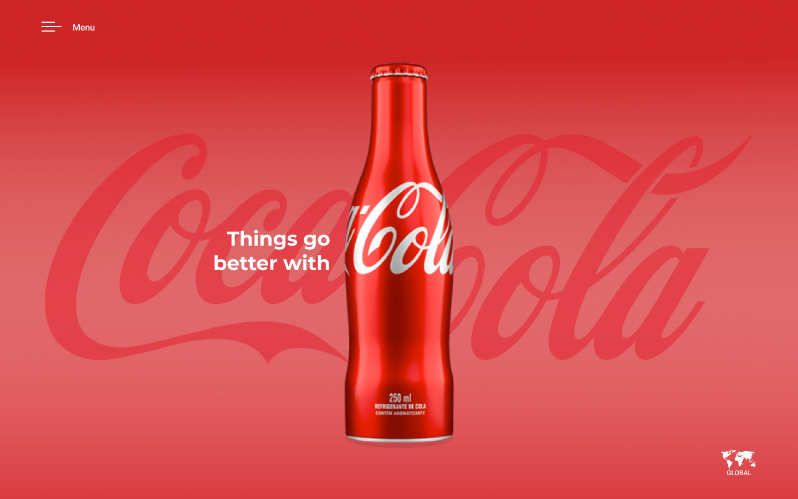

# COCA-COLA

primeiro website criado, do tipo landing page, para treino desenvolvimento de sites.
o site foi desenvolvido utilizando boas práticas, como por exemplo tags semânticas e responsividade.

## TECNOLOGIAS 
* HTML
* CSS
* MEDIA QUERIES

## AUTOR
[André Fioramonte](github.com/andrefioramonte)
